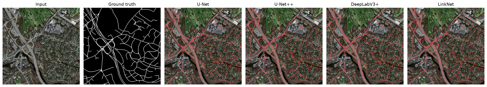
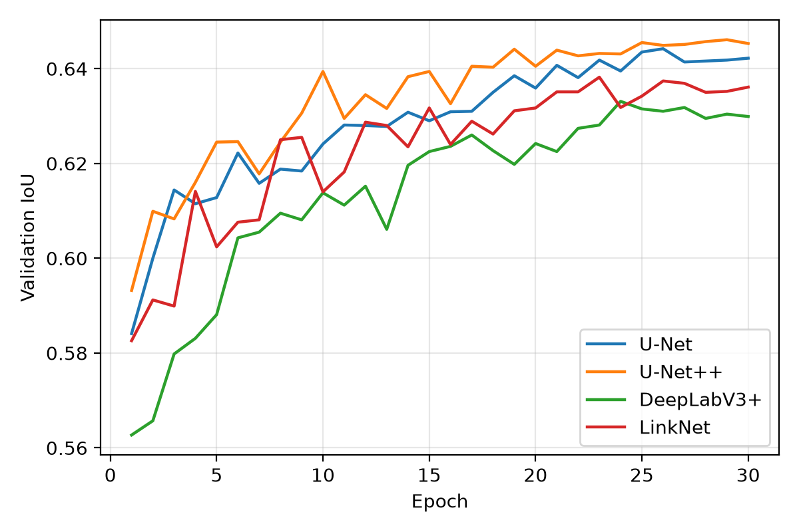

# roadx — Road Extraction from Aerial Imagery

**A controlled comparison of four deep segmentation architectures, with geo-referenced,
OpenStreetMap-validated output — and a live demo that extracts roads anywhere on Earth.**

🛣️ **[Live demo](https://huggingface.co/spaces/shuklaabhinavv/roadx)** ·
📓 **[Kaggle showcase notebook](https://www.kaggle.com/code/shuklaabhinav/road-extraction-4-model-comparative-study)** ·
📄 IEEE-format paper in [`paper/`](paper/)

---

## What this is

Which segmentation architecture is best for extracting road networks from aerial
imagery? Published papers are hard to compare — every author trains differently.
This project trains **U-Net, U-Net++, DeepLabV3+, and LinkNet** under a *strictly
identical* protocol (same ResNet-34 encoder, loss, optimizer, schedule,
augmentation, batch size, and data splits) on the
[Massachusetts Roads Dataset](https://www.cs.toronto.edu/~vmnih/data/), so measured
differences come from the architecture alone. It then goes beyond pixel masks:
detections are converted to real-world coordinates, exported as GeoJSON, validated
against OpenStreetMap, and served through an interactive web app.

## Results

### Test set (441 held-out tiles, Massachusetts)

| Model | IoU | F1 | Precision | Recall | Params (M) | ms/tile |
|---|---|---|---|---|---|---|
| **U-Net++** | **0.654** | **0.791** | 0.808 | 0.774 | 26.1 | 199.8 |
| U-Net | 0.650 | 0.788 | 0.807 | 0.770 | 24.4 | 110.5 |
| LinkNet | 0.649 | 0.787 | 0.803 | 0.771 | **21.8** | **105.0** |
| DeepLabV3+ | 0.642 | 0.782 | 0.798 | 0.766 | 22.4 | 117.5 |
| Ensemble (×4) | 0.656 | 0.792 | 0.814 | 0.772 | 94.7 | 488.3 |



### Key findings

- **U-Net++ wins on accuracy** — but at ~2× the inference cost. **LinkNet delivers
  99% of the accuracy at half the latency** with the fewest parameters.
- **The ranking inverts under domain shift.** Evaluated zero-shot on DeepGlobe
  imagery (India/Indonesia/Thailand), LinkNet transfers best (IoU 0.159) and the
  in-domain champion U-Net++ transfers worst (0.125). Precision stays high while
  recall collapses: models don't hallucinate abroad, they just miss unfamiliar
  (mostly unpaved) roads.
- **Geo-referenced output is as OSM-consistent as human annotation** — correctness
  0.985 vs. the ground truth's 0.979 within a 6 m buffer.
- **The four architectures make correlated errors**: ensembling adds only +0.002 IoU.
- Failures are systematic, not random: tree-canopy-occluded roads and ultra-dense
  historic street grids.



## The web app

Upload an aerial image, or pan a live satellite map to **any place on Earth** and
extract its road network — detections are drawn as vectors over OpenStreetMap at
their true coordinates, with per-model benchmark stats.

```bash
python -m roadx.app   # http://localhost:8501
```

Or use the hosted version: **https://huggingface.co/spaces/shuklaabhinavv/roadx**
(free CPU hardware — extractions take ~30–60 s).

## Reproduce everything

```bash
uv venv && uv pip install -r requirements.txt -e .
source .venv/bin/activate

python -m roadx.data.download --out data/raw --all     # ~8 GB from the UofT mirror
python -m roadx.data.tile --raw data/raw --out data/tiles
python -m roadx.train --model unet                     # unetpp | deeplabv3plus | linknet
python -m roadx.evaluate --data data/tiles --runs runs --ensemble
python -m roadx.figures --data data --runs runs
python -m roadx.georef --checkpoint runs/unetpp/best.pt \
    --image data/raw/test/sat/22078975_15.tiff         # GeoJSON + map + OSM stats
```

Full training used free Kaggle T4 GPUs — ready-made notebooks are in
[`notebooks/`](notebooks/) (Kaggle and Colab variants; the training notebooks are
generated from this repo's own sources by `scripts/make_notebooks.py`).

Cross-dataset evaluation (DeepGlobe): `python -m roadx.data.deepglobe` then
`python -m roadx.evaluate --data data/deepglobe/tiles`.

## Project structure

```
src/roadx/
  data/        download, tiling, dataset, DeepGlobe prep
  train.py     one command per architecture, identical recipe
  evaluate.py  metrics table (CSV + LaTeX), ensemble
  figures.py   training curves, qualitative grids, failure analysis
  georef.py    pixels → lat/lon → GeoJSON, folium map, OSM validation
  predict.py   sliding-window inference + overlays
  app.py       FastAPI web app (upload + anywhere-on-Earth modes)
web/           frontend (Leaflet)
paper/         IEEE conference paper (LaTeX, compiles with tectonic)
notebooks/     Kaggle/Colab training + public showcase notebooks
deploy/        Hugging Face Spaces deployment (Dockerfile + guide)
results/       comparison tables, figures, geo-referenced outputs
```

## Training protocol (identical for all models)

ResNet-34 encoder (ImageNet) · Dice+BCE loss · AdamW 3e-4, wd 1e-4 · cosine
schedule, 30 epochs · batch 8 · 512×512 tiles · flips/rot90/brightness-contrast ·
fixed seed · best-val-IoU checkpointing.

## Acknowledgments

Massachusetts Roads Dataset by V. Mnih (2013); DeepGlobe 2018 road extraction
dataset; architectures via
[segmentation-models-pytorch](https://github.com/qubvel-org/segmentation_models.pytorch);
satellite tiles © Esri, map data © OpenStreetMap contributors.
